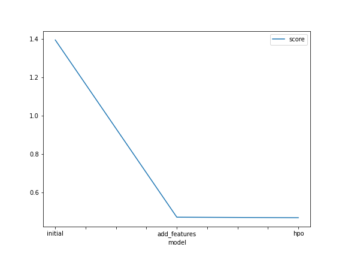

# Report: Predict Bike Sharing Demand with AutoGluon Solution
#### Brian Bodemann

## Initial Training
### What did you realize when you tried to submit your predictions? What changes were needed to the output of the predictor to submit your results?
In order to submit the predictions:
*Results need to filtered of negative counts
*Results needed to be added to submission dataframe
*Submission dataframe needed to outputed to csv `index=False`

### What was the top ranked model that performed?
The top ranked model was a single ensemble of Bayesian optimizations of the learning_rate hyperparameter of the MXnet Neural Net model. I was very curious about adapting the data to perform well on neural nets, so I categorized time variables and observed good performance on MXnet NN.

## Exploratory data analysis and feature creation
### What did the exploratory analysis find and how did you add additional features?
The exploratory data analysis revealed:
*datetime was a confounding variable for prediction because of its non-linear relationship to count
*datetime could be spread out to categories day of week, day of month, hour, and month
*season and weather could be converted to categories

### How much better did your model preform after adding additional features and why do you think that is?
The model improved substantially. I believe this is because I was able to convert the nonlinear variable datetime to informative categories which were more likely to predict bike usage.

## Hyper parameter tuning
### How much better did your model preform after trying different hyper parameters?
I took the approach of tuning a single hyperparameter learning_rate in a single model MXnet NN. I used a smooth points on a logarithmic scale to learn about how learning rate affects iterative model improvement. Finally, I used autogluon's in-built bayesian optimization to tune this variable during iteration, and this unsurprisingly performed the best. Suprisingly, the single hp-optimized model outperformed Autogluon's ensemble approach during the same time period.

### If you were given more time with this dataset, where do you think you would spend more time?
Given more time, I would retrain the other models (XGBoost, Random Forest, etc.) along with the optimized MXnet NN model. I would also increase the time of optimization dramatically to allow each model to improve more.

### Create a table with the models you ran, the hyperparameters modified, and the kaggle score.
|model|hpo|score|
|--|--|--|
|initial|n/a|1.39312|
|add_features|n/a|0.54117|
|hpo1|learning_rate|0.47844|
|hpo2|learning_rate|0.47972|
|hpo3|learning_rate|0.47972|
|hpo4|learning_rate|0.50527|
|hpo5|learning_rate|0.65340|
|hpo6|learning_rate|0.47192|
|hpo7|dropout_prob|0.49027|

### Create a line plot showing the top model score for the three (or more) training runs during the project.

PLEASE NOTE, the scale changed after removing / categorizing features, so this graph is ostensibly meaningless.

### Create a line plot showing the top kaggle score for the three (or more) prediction submissions during the project.
This Graph definitely means something

## Summary
I tested the importance of the learning rate, a key hyperparameter in Neural Nets training.  I used a range of values so as to be able to interpret the results of the experiment. I then used Bayesian optimization of the learning rate hyperparameter, to show that the in-built mechanism is better than randomly guessing hyperparameters. I am pleased the results were interpretable, and I learned a lot about how to tune hyperparameters and how to deal with frequent crashes using unstable features. I am very happy with the project experience and looking forward to the next one!
